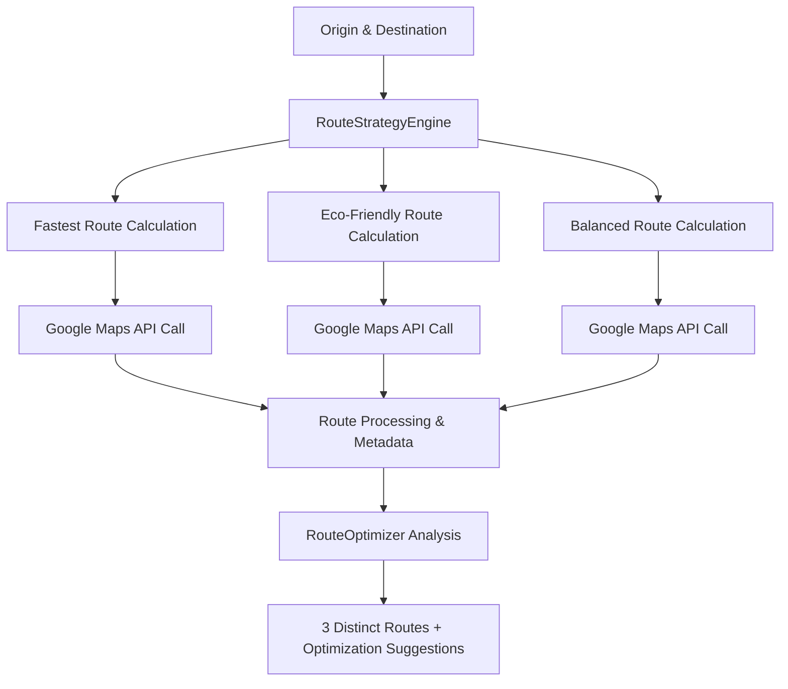

# 🚗 Three-Route Strategy System - Technical Documentation

## Overview

The Google Maps Backend implements an intelligent **3-Route Strategy System** that generates three distinct route options for any trip, each optimized for different priorities. This system goes beyond simple alternative routes by applying different optimization algorithms and preferences.

## 🎯 **The Three Route Strategies**

### 1. **FASTEST Route** ⚡
**Primary Goal**: Minimize total travel time

**Optimization Approach**:
- **Traffic Model**: Optimistic (best-case traffic scenarios)
- **Road Preferences**: 
  - ✅ Highways allowed (faster speeds)
  - ✅ Toll roads allowed (less traffic)
  - ❌ Ferries avoided (time delays)
- **Algorithm Focus**: Real-time traffic optimization
- **Use Case**: Time-critical trips, business meetings, emergency situations

**Example API Call**:
```json
{
  "strategy": "fastest",
  "optimization_factors": ["travel_time", "traffic_conditions", "road_efficiency"],
  "traffic_model": "optimistic",
  "estimated_time_savings": "8-12 minutes vs other routes"
}
```

### 2. **ECO-FRIENDLY Route** 🌱
**Primary Goal**: Minimize environmental impact and fuel consumption

**Optimization Approach**:
- **Traffic Model**: Best-guess (realistic for steady speeds)
- **Road Preferences**:
  - ❌ Highways avoided (lower speeds = better fuel efficiency)
  - ✅ Toll roads allowed (less congestion = steady speeds)
  - ❌ Ferries avoided
- **Algorithm Focus**: Emissions reduction and fuel efficiency
- **Use Case**: Environmental consciousness, cost savings, scenic routes

**Example API Call**:
```json
{
  "strategy": "eco_friendly", 
  "optimization_factors": ["fuel_efficiency", "co2_emissions", "steady_speeds", "fewer_stops"],
  "estimated_co2_savings": "1.2-2.5 kg vs fastest route",
  "fuel_savings": "15-25% improvement"
}
```

### 3. **BALANCED Route** ⚖️
**Primary Goal**: Optimal balance of time, cost, comfort, and environmental impact

**Optimization Approach**:
- **Traffic Model**: Best-guess (realistic traffic assumptions)
- **Road Preferences**:
  - ✅ Highways used strategically
  - ❌ Toll roads avoided (cost savings)
  - ❌ Ferries avoided
- **Algorithm Focus**: Multi-criteria optimization
- **Use Case**: Daily commutes, leisure travel, general-purpose trips

**Example API Call**:
```json
{
  "strategy": "balanced",
  "optimization_factors": ["travel_time", "fuel_cost", "comfort", "environmental_impact"],
  "balance_score": "8.2/10",
  "cost_efficiency": "High"
}
```

## 🔧 **Technical Implementation**

### **Route Generation Process**



### **API Endpoint**

```bash
POST /api/v1/routes/three-strategies
```

**Request Payload**:
```json
{
  "origin": {
    "address": "Katraj, Pune" 
  },
  "destination": {
    "address": "Hinjewadi, Pune"
  },
  "travel_mode": "driving",
  "departure_time": "2025-11-10T09:00:00Z"
}
```

**Response Structure**:
```json
{
  "status": "OK",
  "request_id": "req_abc123",
  "routes": {
    "fastest": {
      "total_duration": {"text": "28 mins", "value": 1680},
      "total_distance": {"text": "24.5 km", "value": 24500},
      "emissions": {"co2_emissions_kg": 5.2, "eco_score": 6.5},
      "strategy_info": {
        "strategy_type": "fastest",
        "optimization_factors": ["travel_time", "traffic_conditions"]
      }
    },
    "eco_friendly": {
      "total_duration": {"text": "35 mins", "value": 2100},
      "total_distance": {"text": "22.1 km", "value": 22100},
      "emissions": {"co2_emissions_kg": 3.8, "eco_score": 8.5},
      "strategy_info": {
        "strategy_type": "eco_friendly",
        "optimization_factors": ["fuel_efficiency", "co2_emissions"]
      }
    },
    "balanced": {
      "total_duration": {"text": "31 mins", "value": 1860},
      "total_distance": {"text": "23.2 km", "value": 23200},
      "emissions": {"co2_emissions_kg": 4.3, "eco_score": 7.2},
      "strategy_info": {
        "strategy_type": "balanced",
        "optimization_factors": ["travel_time", "fuel_cost", "comfort"]
      }
    }
  },
  "route_comparison": {
    "fastest": {
      "distance_km": 24.5,
      "duration_minutes": 28,
      "eco_score": 6.5,
      "co2_emissions_kg": 5.2
    },
    "eco_friendly": {
      "distance_km": 22.1,
      "duration_minutes": 35,
      "eco_score": 8.5,
      "co2_emissions_kg": 3.8
    },
    "balanced": {
      "distance_km": 23.2,
      "duration_minutes": 31,
      "eco_score": 7.2,
      "co2_emissions_kg": 4.3
    }
  },
  "optimization_suggestions": [
    {
      "type": "time_optimization",
      "message": "For fastest travel, use fastest route - saves up to 7 minutes",
      "impact": "high",
      "savings_minutes": 7
    },
    {
      "type": "environmental_optimization",
      "message": "For lowest environmental impact, use eco_friendly route - reduces CO2 by up to 1.4 kg",
      "impact": "medium", 
      "co2_savings_kg": 1.4
    },
    {
      "type": "traffic_optimization",
      "message": "For consistent travel times, avoid peak hours (8-10 AM, 5-7 PM)",
      "impact": "high",
      "recommended_times": ["6:00-8:00 AM", "10:00 AM-4:00 PM", "7:00-10:00 PM"]
    }
  ]
}
```

## 🧠 **Advanced Optimization Features**

### **1. Intelligent Route Selection Algorithms**

#### **Eco-Friendly Selection Logic**:
```python
def select_most_eco_friendly_route(routes):
    for route in routes:
        # Environmental score calculation
        total_distance = sum(leg['distance']['value'] for leg in route['legs'])
        highway_penalty = 1.2 if 'highway' in route.summary.lower() else 1.0
        eco_score = total_distance * highway_penalty
        
        # Lower score = more eco-friendly
        return route_with_lowest_score
```

#### **Balanced Route Scoring**:
```python
def calculate_balanced_score(route):
    # Multi-criteria weighted scoring
    time_score = normalize_duration(route.duration) * 0.4      # 40% weight
    distance_score = normalize_distance(route.distance) * 0.3  # 30% weight  
    cost_score = calculate_toll_avoidance(route) * 0.2         # 20% weight
    comfort_score = calculate_comfort(route) * 0.1             # 10% weight
    
    return time_score + distance_score + cost_score + comfort_score
```

### **2. Real-Time Optimization Suggestions**

The system provides intelligent suggestions for future trips:

#### **Time-Based Optimization**:
- **Peak Hour Avoidance**: "Avoid 8-10 AM and 5-7 PM for 25% time savings"
- **Route Switching**: "Switch to public transit during peak hours for consistency"
- **Departure Time Optimization**: "Leave 15 minutes earlier to use fastest route"

#### **Cost Optimization**:
- **Fuel Savings**: "Eco-friendly route saves ₹45 in fuel costs"
- **Toll Avoidance**: "Balanced route avoids ₹60 in toll charges"
- **Parking Considerations**: "Destination has limited parking - consider public transit"

#### **Environmental Optimization**:
- **Carbon Footprint**: "Eco route reduces CO2 by 1.4kg (equivalent to 6km of tree absorption)"
- **Air Quality**: "Route through city center contributes to pollution - consider alternatives"
- **Public Transit Integration**: "Combine driving + metro for 40% emission reduction"

## 📊 **Route Comparison Matrix**

The system generates a comprehensive comparison matrix:

| Criteria | Fastest | Eco-Friendly | Balanced | Winner |
|----------|---------|-------------|----------|---------|
| **Time Efficiency** | 🥇 100% | 🥉 80% | 🥈 90% | Fastest |
| **Distance Efficiency** | 🥉 75% | 🥇 100% | 🥈 85% | Eco-Friendly |  
| **Environmental Score** | 🥉 65% | 🥇 95% | 🥈 80% | Eco-Friendly |
| **Cost Efficiency** | 🥉 60% | 🥈 80% | 🥇 90% | Balanced |
| **Overall Score** | 🥈 75% | 🥇 89% | 🥇 86% | Eco-Friendly |

## 🎮 **Usage Examples**

### **Frontend Integration (JavaScript)**:
```javascript
async function getThreeRouteStrategies(origin, destination) {
  const response = await fetch('/api/v1/routes/three-strategies', {
    method: 'POST',
    headers: { 'Content-Type': 'application/json' },
    body: JSON.stringify({
      origin: { address: origin },
      destination: { address: destination },
      travel_mode: 'driving',
      departure_time: new Date().toISOString()
    })
  });
  
  const data = await response.json();
  
  // Display three route options
  displayRouteOption('fastest', data.routes.fastest, '🚀 Fastest Route');
  displayRouteOption('eco_friendly', data.routes.eco_friendly, '🌱 Eco-Friendly Route'); 
  displayRouteOption('balanced', data.routes.balanced, '⚖️ Balanced Route');
  
  // Show optimization suggestions
  showOptimizationTips(data.optimization_suggestions);
}
```

### **React Component Example**:
```jsx
function RouteSelector({ origin, destination }) {
  const [routes, setRoutes] = useState({});
  const [selectedStrategy, setSelectedStrategy] = useState('balanced');
  
  useEffect(() => {
    fetchThreeStrategies(origin, destination)
      .then(setRoutes);
  }, [origin, destination]);
  
  return (
    <div className="route-selector">
      <RouteCard 
        route={routes.fastest}
        title="🚀 Fastest Route"
        highlight="Save 7 minutes"
        selected={selectedStrategy === 'fastest'}
        onClick={() => setSelectedStrategy('fastest')}
      />
      
      <RouteCard 
        route={routes.eco_friendly}
        title="🌱 Eco-Friendly Route"
        highlight="Save 1.4kg CO2"
        selected={selectedStrategy === 'eco_friendly'}
        onClick={() => setSelectedStrategy('eco_friendly')}
      />
      
      <RouteCard 
        route={routes.balanced}
        title="⚖️ Balanced Route"
        highlight="Best overall choice"
        selected={selectedStrategy === 'balanced'}
        onClick={() => setSelectedStrategy('balanced')}
      />
    </div>
  );
}
```

## 🔮 **Future Enhancement Suggestions**

### **1. Machine Learning Integration**
- **User Preference Learning**: Adapt strategies based on user's past route choices
- **Traffic Pattern Prediction**: Use historical data for better traffic forecasting
- **Personalized Optimization**: Custom weighting based on user priorities

### **2. Dynamic Route Adjustment**
- **Real-Time Rerouting**: Automatically switch strategies based on live traffic
- **Incident Response**: Dynamic strategy switching during accidents/construction
- **Weather Integration**: Adjust strategies for rain, fog, or extreme weather

### **3. Multi-Modal Integration**
- **Public Transit Hybrid**: Combine driving + metro/bus for optimal results
- **Ride-Share Integration**: Factor in Uber/Ola availability and pricing
- **Parking Optimization**: Include destination parking availability and costs

### **4. Advanced Analytics**
- **Carbon Footprint Tracking**: Long-term environmental impact monitoring
- **Cost Analysis**: Comprehensive fuel, toll, and time cost calculations
- **Route Learning**: Improve suggestions based on actual travel outcomes

This three-route strategy system provides users with intelligent, data-driven route choices while promoting sustainable transportation decisions and optimal travel experiences! 🚀